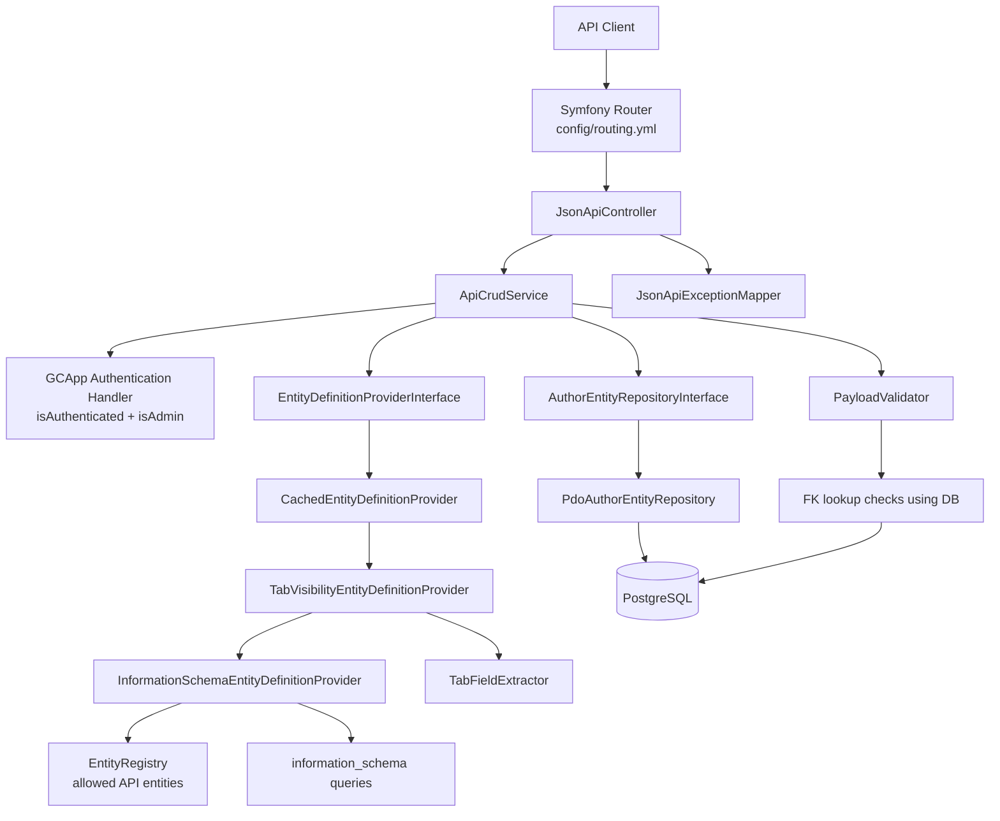
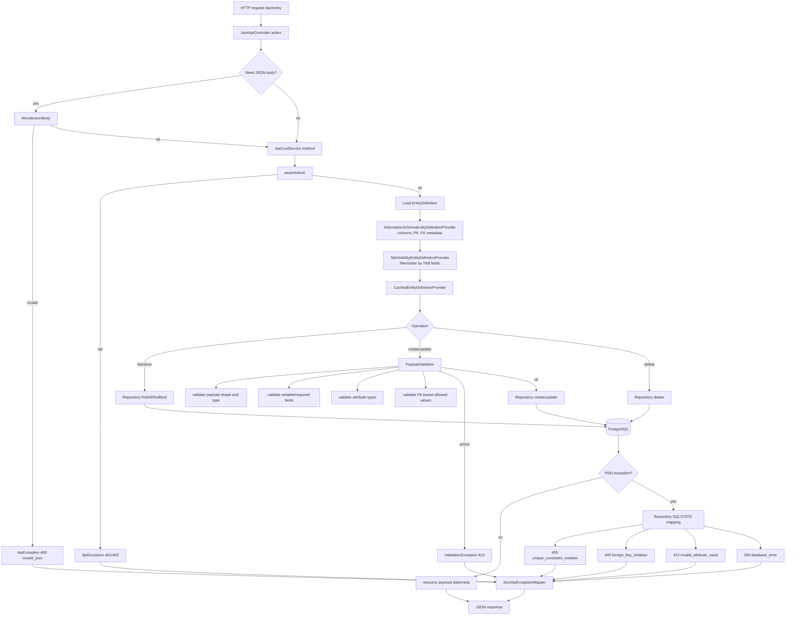

# Author CRUD JSON API (Pilot)

This document describes the current JSON:API flow in the Author backend and the
components involved from controller to database.

Pilot scope:

- `project`
- `project_srs` (scoped under project)
- `catalog` (top-level endpoints, project relationship required on write)

## Endpoints and auth

Base URL:

- Docker default service root: `http://localhost:8080`
- Author JSON:API base path: `http://localhost:8080/author/services/api`

CRUD endpoints:

- `GET /api/{entity}`
- `GET /api/{entity}/{id}`
- `POST /api/{entity}`
- `PUT /api/{entity}/{id}`
- `DELETE /api/{entity}/{id}`

Project-scoped `project_srs` endpoints:

- `GET /api/project/{project}/project_srs`
- `POST /api/project/{project}/project_srs`
- `GET /api/project/{project}/project_srs/{id}`
- `PUT /api/project/{project}/project_srs/{id}`
- `DELETE /api/project/{project}/project_srs/{id}`

Scoped entity naming is canonical (no aliases):

- use `project_srs`
- `srs` is not supported

All `/api/*` endpoints require:

- authenticated session
- admin role

List query params:

- `limit` default `50`, max `200`
- `offset` default `0`
- `sort` e.g. `project_name` or `-project_name`
- `filter[field]=value`
- Relationship filter alias is supported for to-one relations in definitions.
  Example: `filter[project]=default` is normalized to `filter[project_name]=default`.

## Component architecture



## Request flow (controller to database)



## Payload notes (project)

Example create payload:

```json
{
  "data": {
    "type": "project",
    "id": "default",
    "attributes": {
      "project_title": "Default",
      "xc": 501090,
      "yc": 5022596,
      "project_srid": 32632,
      "max_extent_scale": 50000,
      "charset_encodings_id": 2,
      "default_language_id": "it",
      "project_note": null
    }
  }
}
```

`data.id` maps to `project_name`. If both `data.id` and
`data.attributes.project_name` are provided, values must match.

`PUT` is full replace over writable fields for the entity (missing writable
fields are normalized to `null` by validator logic).

## Payload notes (`project_srs`)

`project_srs` is scoped under project routes:

- `POST /api/project/{project}/project_srs`
- `PUT /api/project/{project}/project_srs/{id}`

Write payload requirements:

- `data.type` must be `project_srs`
- `data.id` follows JSON:API string format and is normalized to integer
  internally for `srid` (entity `id_type: int`)
- `relationships.project.data` is required on write
- `relationships.project.data.type` must be `project`
- `relationships.project.data.id` is required and cannot be empty
- `relationships.project.data.id` must match `{project}` in the URL

Example create payload:

```json
{
  "data": {
    "type": "project_srs",
    "id": "32632",
    "attributes": {
      "projparam": null
    },
    "relationships": {
      "project": {
        "data": {
          "type": "project",
          "id": "default"
        }
      }
    }
  }
}
```

## Payload notes (`catalog`)

`catalog` is managed through top-level routes:

- `POST /api/catalog`
- `PUT /api/catalog/{id}`

Write payload requirements:

- `data.type` must be `catalog`
- `relationships.project.data` is required on write
- `relationships.project.data.type` must be `project`
- `relationships.project.data.id` is required and mapped to `project_name`

## Current limitations

- No relationship endpoints are exposed in this pilot.
- `project_srs` returns read-only `relationships.project` data; relationship
  links/endpoints are not exposed.
- Mapfile refresh is not automatically triggered by CRUD writes.

## Relationship write semantics

- Relationship IDs are mapped internally to local FK fields on write.
  Example: `relationships.project.data.id` -> `project_name`.
- Clients should send relationships for references and should not rely on
  writing FK fields directly in `data.attributes` when those are not writable.
- Required attributes backed by relationships are considered satisfied when the
  corresponding relationship `data.id` is present and valid.
