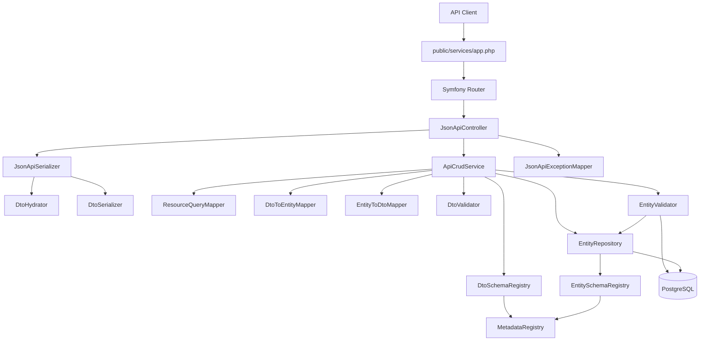
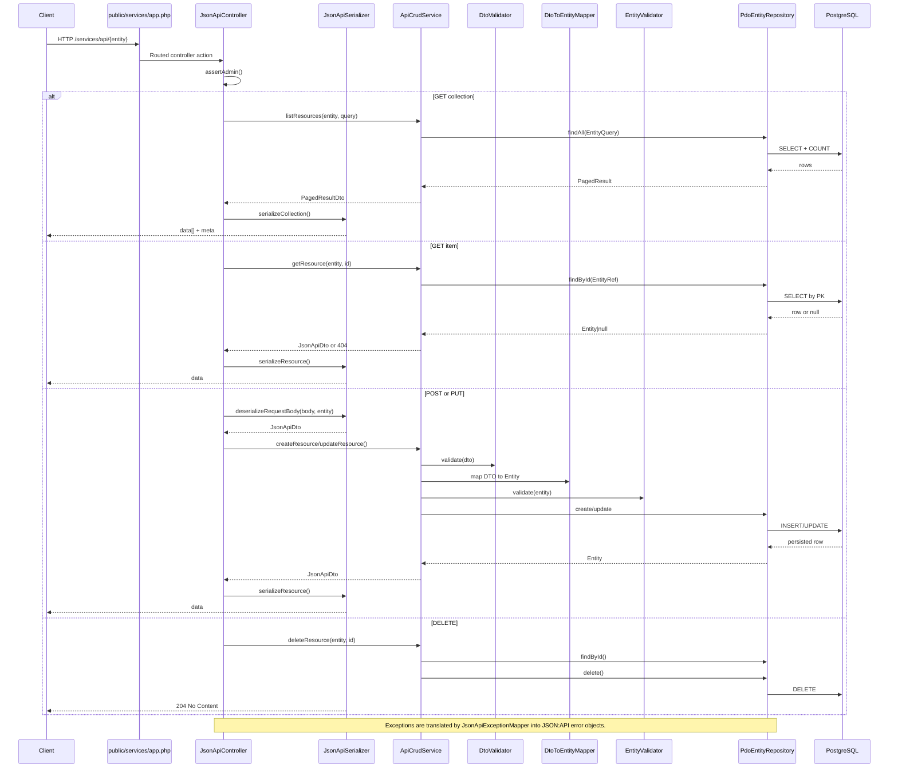

# Author CRUD JSON:API

This document describes the current generic CRUD API implemented in:

- `GisClient\Author\Api`
- `GisClient\Author\Shared`
- `GisClient\Author\Persistence`

It reflects the code path currently used by the Author services front
controller and replaces the old pilot-oriented description.

## Overview

The API is a generic JSON:API-style CRUD layer built around shared metadata.
Each resource type is declared once in `GisClient\Author\Shared\Metadata*`,
and that metadata drives:

- request hydration
- DTO validation
- entity mapping
- persistence schema mapping
- filter/sort rules
- relationship handling
- response serialization

The result is one controller and one service serving multiple Author resources
with consistent behavior.

## Entry point and routing

The HTTP entry point is [public/services/app.php](/Users/ddegasperi/Sites/tmp/gisclient-3/public/services/app.php).
Routes are declared in [config/routing.yml](/Users/ddegasperi/Sites/tmp/gisclient-3/config/routing.yml)
and are exposed through the `public/services/` front controller rewrite.

In a standard local setup this means:

- base service path: `/author/services/`
- API collection path: `/author/services/api/{entity}`
- API item path: `/author/services/api/{entity}/{id}`

Supported methods:

- `GET /api/{entity}`
- `POST /api/{entity}`
- `GET /api/{entity}/{id}`
- `PUT /api/{entity}/{id}`
- `DELETE /api/{entity}/{id}`

There are no resource-specific CRUD routes anymore. All registered resources
use the same generic route set.

## Authentication and authorization

Requests are handled by the security flow in
[public/services/app.php](/Users/ddegasperi/Sites/tmp/gisclient-3/public/services/app.php)
and [config/security.yml](/Users/ddegasperi/Sites/tmp/gisclient-3/config/security.yml).

For `/api/*` endpoints:

- authentication is required
- `JsonApiController` also enforces admin privileges
- unauthenticated requests return `401 authentication_required`
- authenticated non-admin requests return `403 admin_required`

## Registered resource types

The available resource types are registered in
[src/Author/Shared/MetadataRegistry.php](/Users/ddegasperi/Sites/tmp/gisclient-3/src/Author/Shared/MetadataRegistry.php).
At the moment the CRUD API supports:

- `project`
- `project_srs`
- `theme`
- `layergroup`
- `layer`
- `class`
- `style`
- `field`
- `catalog`
- `link`
- `mapset`
- `mapset_layergroup`

Each type defines:

- primary key and id type
- DTO class
- table and schema
- readable and writable attributes
- readable and writable relationships
- required fields for create and put
- allowed filter and sort fields
- optional lookup rules for validation

## Component model



## Request flow



## Metadata-driven design

The metadata classes under
[src/Author/Shared/Metadata](/Users/ddegasperi/Sites/tmp/gisclient-3/src/Author/Shared/Metadata)
are the single source of truth.

From one metadata definition the system builds:

- a `ResourceSchema` for DTO and JSON:API concerns
- an `EntitySchema` for database and repository concerns

This keeps the transport model and persistence model aligned while still
allowing differences such as:

- JSON:API attribute name vs PHP property name
- JSON:API relationship name vs local foreign-key column
- public filter/sort names vs database columns
- string ids in payloads vs integer ids internally

## JSON payload contract

Write requests must send a JSON document with a `data` object.

Minimal structure:

```json
{
  "data": {
    "type": "project",
    "attributes": {}
  }
}
```

Implemented rules:

- `data.type` must match the route entity exactly
- `data.attributes` is required and must be an object, even if empty
- `data.relationships` is optional and must be an object when present
- unknown attributes are rejected with `400 invalid_attribute`
- unknown relationships are rejected with `400 invalid_relationship`

### Resource ids

The serializer always renders resource ids as strings in JSON responses.

On input:

- top-level `data.id` accepts scalar values
- relationship `data.id` accepts scalar values
- integer-backed resources normalize `data.id` to `int` internally
- invalid id formats return `422 invalid_id` or `422 invalid_relationship_id`

### Relationships

Relationships are represented as JSON:API resource identifiers:

```json
{
  "relationships": {
    "project": {
      "data": {
        "type": "project",
        "id": "default"
      }
    }
  }
}
```

Current behavior:

- relationship objects can be identifier-only
- relationship `type` is validated when provided
- relationship ids are required for non-null relationship data
- write relationships are mapped to local FK columns
- read relationships are serialized back as identifier objects only

No relationship endpoints or compound documents are exposed.

## DTO validation

[DtoHydrator](/Users/ddegasperi/Sites/tmp/gisclient-3/src/Author/Api/Serializer/DtoHydrator.php)
and [DtoValidator](/Users/ddegasperi/Sites/tmp/gisclient-3/src/Author/Api/Validation/DtoValidator.php)
enforce the transport contract before persistence.

They validate:

- valid JSON body
- `data` object presence
- exact resource `type`
- `attributes` and `relationships` shape
- attribute JSON types based on metadata
- required fields on create
- required fields on put
- required relationships declared in metadata

Important detail:

- required relationship-backed fields are considered satisfied when the
  relationship contains a non-empty `data.id`

## DTO to entity mapping

[DtoToEntityMapper](/Users/ddegasperi/Sites/tmp/gisclient-3/src/Author/Api/Mapper/DtoToEntityMapper.php)
translates the JSON-facing DTO into an `Entity`.

Key behaviors:

- JSON:API attributes are converted into DB-facing columns
- writable relationships are converted into local FK columns
- a relationship id and its equivalent local FK attribute must match when both
  are provided
- create includes the primary key when `data.id` is supplied
- put is treated as full replacement across writable fields

That last point is important:

- for `PUT`, any writable field omitted from the payload is normalized to `null`
  before repository update

There is no `PATCH` semantics in the current implementation.

## Entity validation

[EntityValidator](/Users/ddegasperi/Sites/tmp/gisclient-3/src/Author/Api/Validation/EntityValidator.php)
validates the persistence-facing entity before writing.

It checks:

- duplicate primary key on create
- non-writable field writes
- immutable primary key on update
- required attributes after relationship-to-column mapping
- referenced related resources exist
- lookup-based attribute constraints defined in metadata

Lookup rules are metadata-driven and support contextual filters. Example:

- `mapset.mapset_srid` is validated against `seldb_mapset_srid`
- the lookup can be filtered by another attribute such as `project_name`

## Query mapping and list behavior

[ResourceQueryMapper](/Users/ddegasperi/Sites/tmp/gisclient-3/src/Author/Api/Mapper/ResourceQueryMapper.php)
maps HTTP query parameters to `EntityQuery`.

Supported query parameters:

- `limit`, default `50`, min `1`, max `200`
- `offset`, default `0`, min `0`
- `sort=field`
- `sort=-field`
- `filter[field]=value`

Validation rules:

- sort fields must be explicitly allowed by metadata
- filter fields must be explicitly allowed by metadata
- `filter` must be an object

Relationship filter aliasing is implemented. If a relationship has a local FK
column, clients can filter by either:

- relationship name, for example `filter[project]=default`
- local column name, for example `filter[project_name]=default`

If both are provided with different values, the API returns
`400 ambiguous_filter_alias`.

Collection responses include:

```json
{
  "meta": {
    "total": 123,
    "limit": 50,
    "offset": 0
  }
}
```

## Persistence layer

[PdoEntityRepository](/Users/ddegasperi/Sites/tmp/gisclient-3/src/Author/Persistence/PdoEntityRepository.php)
is the default repository implementation.

It is responsible for:

- schema/table resolution through `EntitySchemaRegistry`
- select/count queries for collections
- select by primary key
- insert
- update
- delete
- row-to-entity mapping
- SQLSTATE to domain exception mapping

Persistence details worth documenting:

- table and schema names come from metadata
- the default database schema is `gisclient_34`
- integer PKs can be generated through `GCApp::getNewPKey(...)` when omitted on
  create
- repository operations use savepoints when already inside a transaction

## Error mapping

[JsonApiExceptionMapper](/Users/ddegasperi/Sites/tmp/gisclient-3/src/Author/Api/Mapper/JsonApiExceptionMapper.php)
turns exceptions into JSON:API error payloads.

Main mappings:

- `ApiException` -> explicit HTTP error with one JSON:API error object
- `ValidationException` -> `errors[]` payload with JSON pointers
- SQLSTATE `23505` -> `409 unique_constraint_violation`
- SQLSTATE `23503` -> `409 foreign_key_violation`
- SQLSTATE class `22`, `23502`, `23514` -> `422 invalid_attribute_value`
- other repository failures -> `500 database_error`

Typical application-level errors include:

- `400 invalid_json`
- `400 invalid_payload`
- `400 invalid_attribute`
- `400 invalid_relationship`
- `400 invalid_sort_field`
- `400 invalid_filter_field`
- `401 authentication_required`
- `403 admin_required`
- `404 resource_not_found`
- `409 duplicate_primary_key`
- `422 type_mismatch`
- `422 relationship_attribute_mismatch`
- `422 invalid_relationship`

## Example create payload

Example `project` create:

```json
{
  "data": {
    "type": "project",
    "id": "default",
    "attributes": {
      "project_title": "Default",
      "xc": 501090,
      "yc": 5022596,
      "project_srid": 32632,
      "max_extent_scale": 50000,
      "charset_encodings_id": 2,
      "default_language_id": "it",
      "project_note": null
    }
  }
}
```

Example `catalog` create with relationship-driven FK:

```json
{
  "data": {
    "type": "catalog",
    "attributes": {
      "catalog_name": "DB Layers",
      "connection_type": 6,
      "catalog_path": "dbname=mydb"
    },
    "relationships": {
      "project": {
        "data": {
          "type": "project",
          "id": "default"
        }
      }
    }
  }
}
```

## Current limitations

- only top-level CRUD endpoints are exposed
- no `PATCH`
- no relationship endpoints
- no `include`, sparse fieldsets, or pagination links
- relationships in responses are identifier-only, not expanded resources
- filtering is equality-only
- sorting supports a single field
- the API does not trigger side effects such as mapfile refresh automatically
